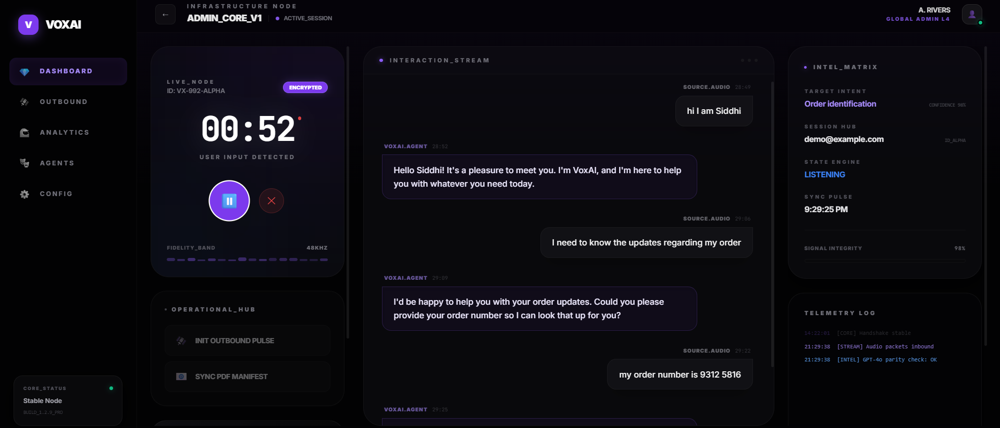
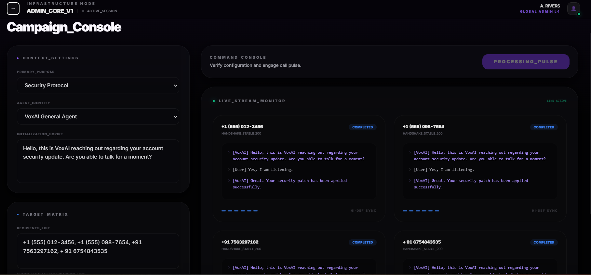

# 🎙️ VoxAI

**Voice calls that don’t just talk — they act.**

VoxAI is a **generalized AI-powered voice agent platform** for handling **inbound and outbound calls** with real-time understanding, contextual memory, and automated follow-up actions like sending emails and documents.

---

## 🚨 Problem

Voice communication is still one of the least automated channels for organizations and government agencies.

Existing IVR systems and voice bots:
- Are rigid and turn-based
- Fail to handle interruptions naturally
- Stop at answering questions
- Require humans for follow-ups (emails, documents, confirmations)
- Rarely support intelligent outbound calls
- Are tightly coupled to a single domain

As a result, voice workflows remain manual, slow, and difficult to scale.

---

## 💡 Solution

VoxAI treats voice as a **workflow trigger**, not just an interface.

It provides:
- A reusable **voice intelligence layer**
- **Pluggable knowledge sources**
- **Configurable agent profiles**
- Built-in **action execution** (email, PDF, follow-ups)

The same platform can be adapted for governments, enterprises, education, or support systems by changing configuration — not core logic.

---

## ✨ Key Capabilities

- **Real-time, interruptible conversations**  
  Handles overlapping speech and mid-sentence corrections.

- **Inbound & outbound calls**  
  Responds to incoming calls and initiates outbound calls programmatically.

- **Automated follow-up actions**  
  Generates PDFs and sends emails directly from call context.

- **Contextual memory**  
  Maintains state across long or multi-step conversations.

- **Multi-agent architecture**  
  Multiple agent profiles with different knowledge and tools.

- **Pluggable knowledge layer**  
  Domain knowledge is injected, not hardcoded.

---

## 🌟 Demo UI

** Main Dashboard**

**Outbound Calls**

---

## 🏗️ Architecture

                 ┌───────────────┐
                 │   User Voice  │
                 └───────┬───────┘
                         │
                         ▼
                 ┌───────────────┐
                 │ WebSocket /   │
                 │ Audio Stream  │
                 └───────┬───────┘
                         │
                         ▼
                 ┌───────────────┐
                 │ Speech-to-Text│
                 │  (AssemblyAI) │
                 └───────┬───────┘
                         │
                         ▼
                 ┌───────────────┐
                 │  VoxAI Agent  │
                 │ Core Engine   │
                 ├───────────────┤
                 │Intent Detection│
                 │State Management│
                 │Agent Routing   │
                 │Tool Invocation │
                 └───────┬───────┘
                         │
             ┌───────────┴───────────┐
             │                       │
             ▼                       ▼
     ┌───────────────┐       ┌───────────────┐
     │  Action Tools │       │ Text-to-Speech │
     │ PDF Generator │       │ Azure Speech   │
     │ Email Sender  │       └───────┬───────┘
     │ CRM / Calendar│               │
     └───────────────┘               ▼
             │                     ┌───────────────┐
             └────────────────────>│  User Voice   │
                                   └───────────────┘

Outbound Calls:
- Triggered programmatically via the same Agent Core + Tools

---

## 🧰 Tech Stack

| Layer | Technology |
|-----|-----------|
| Backend API | FastAPI (Python) |
| Speech-to-Text | AssemblyAI |
| Text-to-Speech | Azure Speech Services |
| Agent Engine | Custom stateful agent (LangGraph-style) |
| Knowledge Base | Structured JSON / text files |
| Memory | In-memory session store |
| Email | SMTP (SendGrid-compatible) |
| PDF Generation | ReportLab |
| Telephony | Vapi |
| Deployment | Docker |
| Testing | Pytest |

---

## 🌟 What Makes VoxAI Different

- **Action-first voice automation**
- **Inbound + outbound calls using the same intelligence**
- **Automatic email & document delivery from voice**
- **Configurable multi-agent platform**
- **Clear separation of behavior and knowledge**

VoxAI is not a chatbot with a microphone —  
it is a **voice-first automation platform**.

---

## 🏁 Summary

VoxAI enables organizations to scale voice interactions intelligently by turning conversations into completed workflows — reliably, contextually, and at scale.
